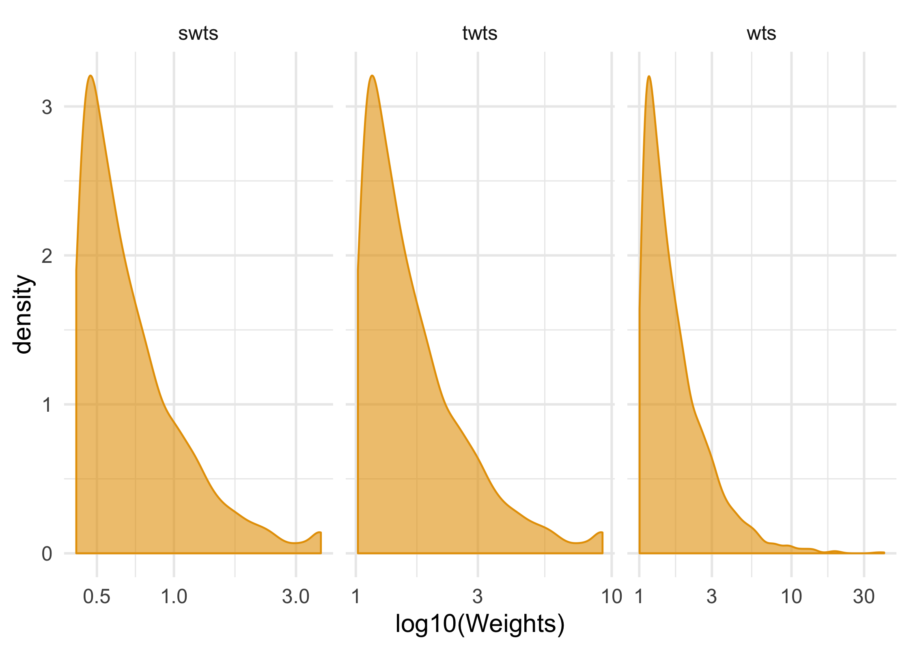

<!-- README.md is generated from README.Rmd. Please edit that file -->

# The causal effect of RHC on death using inverse probability weighting

``` r
library(tidyverse)
library(broom)
library(geepack)

rhc <- read_csv("rhc.csv") %>% 
  rename(id = X1) %>% 
  mutate(swang1 = factor(swang1, levels = c("No RHC", "RHC")),
         death = factor(death, levels = c("No", "Yes")))

ps_variables <- rhc %>% 
  select(-id, -sadmdte:-death, -cat1:-cat2, -t3d30, -dth30, -swang1, -ortho, -adld3p, -ptid) %>% 
  names()

fmla <- paste("swang1 ~", paste(ps_variables, collapse = "+")) %>% 
  as.formula()

propensity <- rhc %>% 
  mutate_if(is.character, factor) %>% 
  glm(fmla, family = binomial(), data = .)

propensity %>% 
  tidy(conf.int = TRUE) %>% 
  select(-statistic, -p.value) %>% 
  mutate_at(vars(-term, -std.error), exp) %>% 
  knitr::kable(digits = 2)
```

| term                        |     estimate | std.error | conf.low |    conf.high |
| :-------------------------- | -----------: | --------: | -------: | -----------: |
| (Intercept)                 | 640853762.15 |      4.66 | 71157.89 | 6.237038e+12 |
| caNo                        |         2.34 |      0.65 |     0.64 | 8.460000e+00 |
| caYes                       |         1.78 |      0.23 |     1.14 | 2.820000e+00 |
| cardiohx                    |         1.26 |      0.14 |     0.96 | 1.640000e+00 |
| chfhx                       |         1.25 |      0.15 |     0.93 | 1.660000e+00 |
| dementhx                    |         0.75 |      0.17 |     0.53 | 1.060000e+00 |
| psychhx                     |         0.66 |      0.19 |     0.45 | 9.500000e-01 |
| chrpulhx                    |         0.94 |      0.14 |     0.72 | 1.230000e+00 |
| renalhx                     |         0.60 |      0.26 |     0.36 | 9.900000e-01 |
| liverhx                     |         0.54 |      0.24 |     0.33 | 8.700000e-01 |
| gibledhx                    |         1.09 |      0.33 |     0.57 | 2.070000e+00 |
| malighx                     |         0.82 |      0.60 |     0.25 | 2.680000e+00 |
| immunhx                     |         0.83 |      0.11 |     0.68 | 1.030000e+00 |
| transhx                     |         1.51 |      0.13 |     1.17 | 1.950000e+00 |
| amihx                       |         1.10 |      0.23 |     0.70 | 1.710000e+00 |
| age                         |         0.99 |      0.00 |     0.99 | 1.000000e+00 |
| sexMale                     |         1.06 |      0.10 |     0.88 | 1.290000e+00 |
| edu                         |         1.03 |      0.02 |     0.99 | 1.060000e+00 |
| surv2md1                    |         0.30 |      0.48 |     0.12 | 7.700000e-01 |
| das2d3pc                    |         0.99 |      0.01 |     0.97 | 1.010000e+00 |
| aps1                        |         1.01 |      0.00 |     1.00 | 1.020000e+00 |
| scoma1                      |         1.00 |      0.00 |     0.99 | 1.000000e+00 |
| meanbp1                     |         0.99 |      0.00 |     0.99 | 1.000000e+00 |
| wblc1                       |         1.01 |      0.00 |     1.00 | 1.010000e+00 |
| hrt1                        |         1.00 |      0.00 |     1.00 | 1.010000e+00 |
| resp1                       |         0.98 |      0.00 |     0.97 | 9.900000e-01 |
| temp1                       |         0.99 |      0.03 |     0.94 | 1.050000e+00 |
| pafi1                       |         0.99 |      0.00 |     0.99 | 1.000000e+00 |
| alb1                        |         0.94 |      0.06 |     0.84 | 1.050000e+00 |
| hema1                       |         0.99 |      0.01 |     0.97 | 1.000000e+00 |
| bili1                       |         1.01 |      0.01 |     0.99 | 1.030000e+00 |
| crea1                       |         1.08 |      0.03 |     1.02 | 1.150000e+00 |
| sod1                        |         0.98 |      0.01 |     0.97 | 9.900000e-01 |
| pot1                        |         0.87 |      0.05 |     0.79 | 9.500000e-01 |
| paco21                      |         0.97 |      0.01 |     0.96 | 9.800000e-01 |
| ph1                         |         0.13 |      0.58 |     0.04 | 3.900000e-01 |
| wtkilo1                     |         1.00 |      0.00 |     1.00 | 1.010000e+00 |
| dnr1Yes                     |         0.40 |      0.18 |     0.28 | 5.700000e-01 |
| ninsclasMedicare            |         1.24 |      0.20 |     0.84 | 1.840000e+00 |
| ninsclasMedicare & Medicaid |         1.77 |      0.24 |     1.11 | 2.850000e+00 |
| ninsclasNo insurance        |         1.81 |      0.26 |     1.09 | 3.020000e+00 |
| ninsclasPrivate             |         1.50 |      0.18 |     1.05 | 2.160000e+00 |
| ninsclasPrivate & Medicare  |         1.78 |      0.20 |     1.20 | 2.650000e+00 |
| respYes                     |         0.62 |      0.12 |     0.49 | 7.900000e-01 |
| cardYes                     |         1.82 |      0.14 |     1.38 | 2.400000e+00 |
| neuroYes                    |         0.51 |      0.21 |     0.34 | 7.600000e-01 |
| gastrYes                    |         1.26 |      0.16 |     0.92 | 1.740000e+00 |
| renalYes                    |         0.88 |      0.28 |     0.51 | 1.520000e+00 |
| metaYes                     |         0.88 |      0.33 |     0.45 | 1.670000e+00 |
| hemaYes                     |         0.68 |      0.29 |     0.38 | 1.180000e+00 |
| sepsYes                     |         1.54 |      0.14 |     1.18 | 2.000000e+00 |
| traumaYes                   |         3.35 |      0.37 |     1.65 | 7.020000e+00 |
| urin1                       |         1.00 |      0.00 |     1.00 | 1.000000e+00 |
| raceother                   |         1.22 |      0.21 |     0.80 | 1.840000e+00 |
| racewhite                   |         1.02 |      0.13 |     0.79 | 1.330000e+00 |
| income$11-$25k              |         1.13 |      0.19 |     0.78 | 1.650000e+00 |
| income$25-$50k              |         1.24 |      0.19 |     0.86 | 1.800000e+00 |
| incomeUnder $11k            |         1.02 |      0.19 |     0.70 | 1.500000e+00 |

``` r

rhc <- propensity %>% 
  augment(type.predict = "response", data = rhc) %>% 
  # propensity for treatment in exposed, 
  # propensity of non-treatment in unexposed
  mutate(wts = 1 / ifelse(swang1 == "No RHC", 1 - .fitted, .fitted)) 
    
rhc %>% 
  summarize(mean_wt = mean(wts), sd_wts = sd(wts), min_wts = min(wts), max_wts = max(wts)) %>% 
  knitr::kable(digits = 2)
```

| mean\_wt | sd\_wts | min\_wts | max\_wts |
| -------: | ------: | -------: | -------: |
|     1.98 |    1.82 |        1 |    40.64 |

``` r

rhc %>% 
  group_by(swang1) %>% 
  summarize(mean_wt = mean(wts), sd_wts = sd(wts), min_wts = min(wts), max_wts = max(wts)) %>% 
  knitr::kable(digits = 2)
```

| swang1 | mean\_wt | sd\_wts | min\_wts | max\_wts |
| :----- | -------: | ------: | -------: | -------: |
| No RHC |     1.68 |    1.11 |     1.00 |    19.55 |
| RHC    |     2.41 |    2.45 |     1.01 |    40.64 |

``` r

#  marginal probability of RHC
sw_model <- glm(swang1 ~ 1, data = rhc, family = binomial())

numerator <- predict(sw_model, type = "response")

percentiles <- quantile(rhc$wts, probs = c(.01, .99))

rhc <- rhc %>% 
  mutate(
    # truncate weights (less extreme weights)
    twts = case_when(
      wts < percentiles[1] ~ percentiles[1],
      wts > percentiles[2] ~ percentiles[2],
      TRUE ~ wts
    ),
    # stabilize weights (better efficiency and coverage)
    swts = numerator / (1 / twts), 
)

rhc %>% 
  summarize(mean_wt = mean(swts), sd_wts = sd(swts), min_wts = min(swts), max_wts = max(swts)) %>% 
  knitr::kable(digits = 2)
```

| mean\_wt | sd\_wts | min\_wts | max\_wts |
| -------: | ------: | -------: | -------: |
|     0.78 |    0.53 |     0.42 |     3.75 |

``` r

rhc %>% 
  gather("wt_type", "value", wts, twts, swts) %>% 
  ggplot(aes(value)) +
    geom_density(col = "#E69F00", fill = "#E69F0099") + 
    facet_wrap(~ wt_type, scales = "free_x") +
    scale_x_log10() + 
    theme_minimal(base_size = 14) + 
    xlab("log10(Weights)") 
```

<!-- -->

``` r

# fit a marginal structural model
# a little trouble with factors with these. 
rhc <- rhc %>% 
  mutate(y = ifelse(death == "Yes", 1, 0))

msm <- geeglm(y ~ swang1, 
                  data = rhc, 
                  family = binomial(),
                  std.err = "san.se", # default robust SE 
                  weights = swts, # inverse probability weights
                  id = id, # pt ide
                  corstr = "independence") # independent correlation structure
tidy(msm)
#>          term  estimate  std.error statistic      p.value
#> 1 (Intercept) 0.3699305 0.05770229 41.101177 1.445493e-10
#> 2   swang1RHC 0.2585361 0.09531426  7.357438 6.678589e-03

#  standard error a little too small
glm(death ~ swang1, data = rhc, weights = swts, family = binomial()) %>% 
  tidy()
#>          term  estimate  std.error statistic      p.value
#> 1 (Intercept) 0.3699305 0.06176219  5.989595 2.103643e-09
#> 2   swang1RHC 0.2585361 0.08982232  2.878306 3.998175e-03

# can also bootstrap SE/CIs
```
